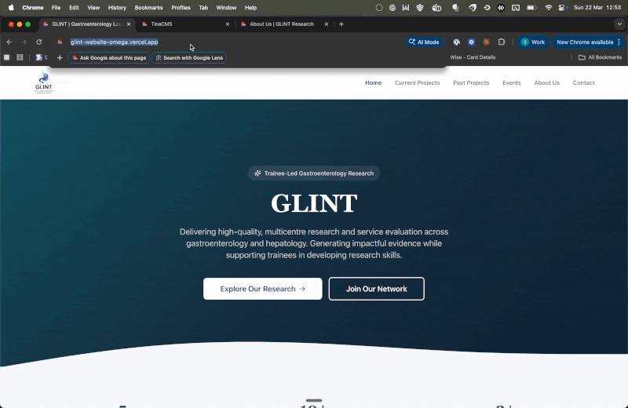
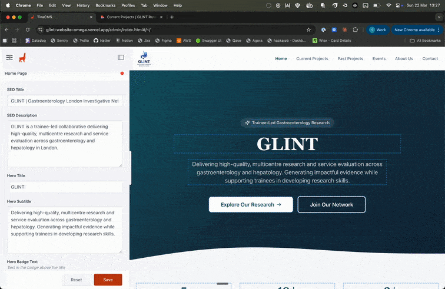
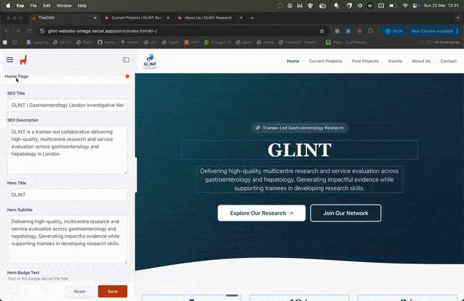

# Content Manager Guide

How to update the GLINT website content using TinaCMS.

---

## Getting Started

### Accessing the CMS

1. Go to **https://glintresearch.co.uk/admin/index.html**
2. Log in with your TinaCMS account credentials (or Github)
3. You'll see the editing interface with the website preview on the right and the content sidebar on the left

> **Important:** After saving any change, it takes approximately **1-2 minutes** for the update to appear on the live website. This is because the site needs to rebuild and redeploy automatically. You don't need to do anything — just wait a moment and refresh the page.

---

## What You Can Edit

The CMS is organised into **two types** of content:

### Page Content
These control the text on each page — headings, subtitles, descriptions, and call-to-action buttons. The page layout and design stay the same; you're just updating the words.

### Collections
These are lists of items that appear on the site — team members, projects, events, and publications. You can add new items, edit existing ones, or remove them.

---

## Editing Page Content

Each page has its own entry in the CMS sidebar. Click on one to edit the text that appears on that page.

### Home Page

Fields you can edit:
- **Hero Title** — the large "GLINT" heading
- **Hero Badge Text** — the small label above the title ("Trainee-Led Gastroenterology Research")
- **Hero Subtitle** — the description text below the title
- **Hero Buttons** — text and links for "Explore Our Research" and "Join Our Network"
- **Stats Bar** — the three statistics (e.g. "5 Publications", "10+ Collaborating Centres")
- **What We Do** — title, subtitle, and the three feature cards
- **Current Projects Section** — title and subtitle text
- **CTA Section** — the "Ready to Get Involved?" title, subtitle, and buttons

### Current Projects Page

- **Hero Title** and **Subtitle**
- **CTA Section** — the "Interested in Collaborating?" text and button

The actual project cards are managed in the **Current Projects** collection (see below).

### Past Projects Page

- **Hero Title** and **Subtitle**

The publications and presentations are managed in the **Publications & Presentations** collection (see below).

### Events Page

- **Hero Title** and **Subtitle**
- **CTA Section** — the "Don't Miss Our Next Event" text and button

The actual events are managed in the **Events** collection (see below).

### About Us Page

- **Hero Title** and **Subtitle**
- **Mission Title** and **Content** — the "Our Mission" section text
- **Values** — the three value cards (Collaboration, Excellence, Development) with titles and descriptions
- **Team Section Title** and **Subtitle**

The team member cards are managed in the **Team Members** collection (see below).

### Contact Page

- **Hero Title** and **Subtitle**
- **Form Title** and **Subtitle** — the heading above the contact form
- **Sidebar Title** — the "Why Join GLINT?" heading
- **Benefits** — the list of reasons to join (you can add, remove, or reorder these)
- **Contact Email** and **Twitter Handle** — shown in the "Connect With Us" section

---

## Managing Collections

Collections are lists of items. You can add new items, edit existing ones, delete them, and reorder them.

### Current Projects

Found under **"Current Projects"** in the sidebar.

Each project has:
| Field | What it controls |
|-------|-----------------|
| **Title** | The project name shown on the card |
| **Status** | The coloured badge (Data Collection, Write-Up Phase, Data Analysis, Completed, Upcoming) |
| **Status Badge Label** | The exact text shown in the badge |
| **Description** | The paragraph describing the project |
| **Objectives** | Bullet point list of project goals |
| **Timeline** | e.g. "2025 - Ongoing" |
| **Network** | e.g. "10+ London centres" |
| **Milestone** | Any notable achievement (e.g. conference presentation) |
| **Display Order** | Lower numbers appear first on the page |

#### Adding a new project

1. Click **"Current Projects"** in the sidebar
2. Click the **"Create New"** button
3. Fill in the fields
4. Click **Save**

#### Editing a project

1. Click **"Current Projects"** in the sidebar
2. Click the project you want to edit
3. Change any fields
4. Click **Save**

#### Deleting a project

1. Click **"Current Projects"** in the sidebar
2. Click the project you want to remove
3. Click the **delete** option (usually via a menu or button at the top)
4. Confirm the deletion

---

### Team Members

Found under **"Team Members"** in the sidebar.

Each team member has:
| Field | What it controls |
|-------|-----------------|
| **Full Name** | Displayed on the card |
| **Role / Position** | e.g. "Chair", "South London Representative" |
| **Initials** | Fallback text when no photo is available (e.g. "CP") |
| **Bio** | The paragraph displayed under their name |
| **Photo** | Upload a headshot image |
| **Display Order** | Lower numbers appear first (e.g. Chair = 1, Vice Chair = 2) |

#### Adding a new team member

1. Click **"Team Members"** in the sidebar
2. Click **"Create New"**
3. Fill in their name, role, bio, and upload a photo
4. Set the **Display Order** to control where they appear in the grid
5. Click **Save**

#### Uploading a photo

When editing a team member, click the **Photo** field. You can upload a JPEG or PNG image. Photos are displayed as circular thumbnails, so square images work best. Aim for at least 200x200 pixels.

#### Changing the order of team members

Update the **Display Order** number on each member. Members are sorted from lowest to highest number. For example:
- Chair = 1
- Vice Chair = 2
- Secretary = 3
- etc.

---

### Events

Found under **"Events"** in the sidebar.

Each event has:
| Field | What it controls |
|-------|-----------------|
| **Event Title** | The name of the event |
| **Date** | Used to determine if the event is upcoming or past |
| **Time** | e.g. "TBC" or "18:00-20:00" |
| **Location** | e.g. "Central London" |
| **Status** | Coming Soon, Open, or Sold Out |
| **Free Event** | Toggles the "Free" badge on/off |
| **Description** | Details about the event |
| **Registration URL** | Link to external ticketing (e.g. Eventbrite) |
| **Display Order** | Lower numbers appear first |

#### How upcoming vs past works

Events are automatically split into "Upcoming" and "Past" sections based on their **Date** field. If the date is in the future, it appears under Upcoming Events. If it's in the past, it moves to Past Events.

> **Note:** This happens when the site rebuilds. After an event's date passes, the change will appear on the live site after the next deployment (usually triggered by any content save, or you can wait for the next scheduled rebuild).

#### Adding a new event

1. Click **"Events"** in the sidebar
2. Click **"Create New"**
3. Set the title, date, time, location, and status
4. Toggle **"Free Event"** if it's free
5. Add a description
6. Click **Save**

#### Marking an event as sold out

1. Click the event
2. Change the **Status** field from "Coming Soon" or "Open" to **"Sold Out"**
3. Click **Save**

---

### Publications & Presentations

Found under **"Publications & Presentations"** in the sidebar.

There are two types of entries — select the type when creating:

#### Publications (journal papers)

| Field | What it controls |
|-------|-----------------|
| **Title** | The paper title |
| **Type** | Set to **"Publication"** |
| **Authors** | Full author string (e.g. "Kader R, Dart RJ... GLINT Research Network") |
| **Journal** | Journal name (e.g. "Frontline Gastroenterol") |
| **Year** | Publication year |
| **Volume** | e.g. "2(6):309-317" |
| **DOI** | The DOI identifier (e.g. "10.1002/ygh2.427") — this creates a clickable link |
| **Display Order** | Lower numbers appear first |

#### Conference Presentations

| Field | What it controls |
|-------|-----------------|
| **Title** | The presentation title |
| **Type** | Set to **"Conference Presentation"** |
| **Venue** | Where it was presented (e.g. "MESSE Conference, Berlin") |
| **Venue Date** | When it was presented (e.g. "October 2025") |
| **Display Order** | Lower numbers appear first |

#### Adding a new publication

1. Click **"Publications & Presentations"** in the sidebar
2. Click **"Create New"**
3. Set **Type** to "Publication"
4. Fill in the title, authors, journal, year, volume, and DOI
5. Set a display order (lower = appears first)
6. Click **Save**

---

## Tips

- **Save often.** TinaCMS saves directly to GitHub, so your changes are safely stored even if you close the browser.

- **Preview before publishing.** After saving, wait 1-2 minutes for the rebuild, then check the live site to make sure everything looks right.

- **Reordering items.** All collections use a **Display Order** field. Change the numbers to reorder — there's no drag-and-drop. You can use any numbers (1, 2, 3 or 10, 20, 30) — only the relative order matters.

- **Images.** When uploading images through the CMS, they're stored in the website's GitHub repository under the `public/` folder. Supported formats: JPEG, PNG, WebP.

- **Undoing a mistake.** If you save something wrong, you can either fix it immediately in the CMS, or ask a developer to revert the change in GitHub (every change is tracked and can be undone).

---

## What You Cannot Change Through the CMS

The following require a developer to update the code:

- Navigation links (the menu at the top)
- Footer links and layout
- Page layouts and design
- Colours, fonts, and styling
- Adding entirely new pages
- The contact form fields or where submissions are sent
- The website logo
